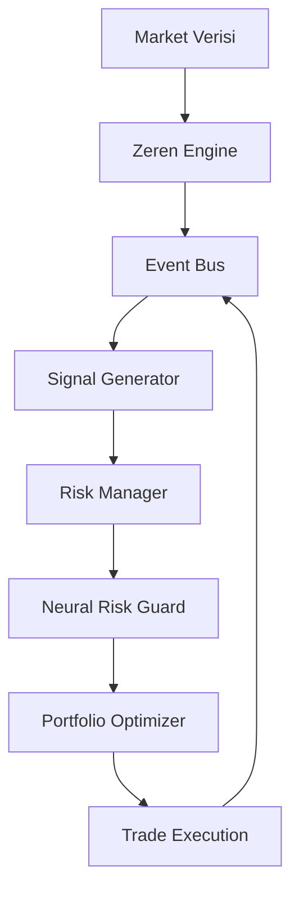

# Zeren AI Lite

Zeren AI Lite, ticari amaçlı geliştirilen ana **Zeren AI** projesinin açık kaynaklı, profesyonel mimari ve mühendislik pratiklerini sergileyen hafifletilmiş (lite) versiyonudur.

> [!IMPORTANT]
> **Not:** Bu depo, projenin sadece temel iskeletini, asenkron iletişim altyapısını ve risk yönetimi mantığını içerir. Tescilli algoritmalar, derin öğrenme modelleri ve veri setleri gizlilik nedeniyle ana projede tutulmaktadır.

## 🌟 Öne Çıkan Özellikler

- **Modüler Asenkron Mimari:** `AIModule` tabanlı, genişletilebilir ve sağlam bir servis yapısı.
- **Event-Driven Haberleşme:** Modüller arası düşük bağımlılık (loose coupling) sağlayan merkezi `EventBus` sistemi.
- **Çok Katmanlı Risk Yönetimi:**
    - **Kelly Kriteri:** Matematiksel optimal pozisyon boyutlandırma.
    - **Neural Risk Guard:** Simüle edilmiş anomali tespiti ve hibrit risk değerlendirmesi.
    - **Sektörel Optimizasyon:** Portföy çeşitlendirmesi ve sektör yoğunlaşma kontrolleri.
- **Sinyal Üretim Motoru:** Teknik analiz (RSI, MACD) ve Scalp/Swing strateji simülasyonları.
- **Mühendislik Standartları:**
    - **Unit Tests:** `pytest` ile %100 kapsanan kritik modüller.
    - **CI/CD:** GitHub Actions ile otomatik test entegrasyonu.
    - **i18n:** TR/EN tam senkronize dil desteği.

## 🏗️ Mimari Yapı



## 📂 Dosya Yapısı

- `src/core/`: EventBus, temel modül sınıfları ve sistem çekirdeği.
- `src/strategy/`: Risk yönetimi, sinyal üretimi ve portföy optimizasyonu.
- `tests/`: Sistem güvenilirliğini sağlayan birim testleri.
- `.github/workflows/`: Otomatik test ve dağıtım süreçleri.

## 🚀 Başlangıç

### Gereksinimler
- Python 3.9+
- `pip install .` (Temel bağımlılıklar için)
- `pip install ".[test]"` (Testleri çalıştırmak için)

### Çalıştırma
Sistemi simülasyon modunda başlatmak için:
```bash
python3 main.py
```

### Testleri Çalıştırma
```bash
pytest tests/
```

## ⚠️ Yasal Uyarı
Bu proje eğitim ve portfolyo amaçlıdır. **YATIRIM TAVSİYESİ DEĞİLDİR.** Finansal piyasalar yüksek risk içerir.

---
*© 2026 Zeren AI - Advanced Agentic Coding Team*
