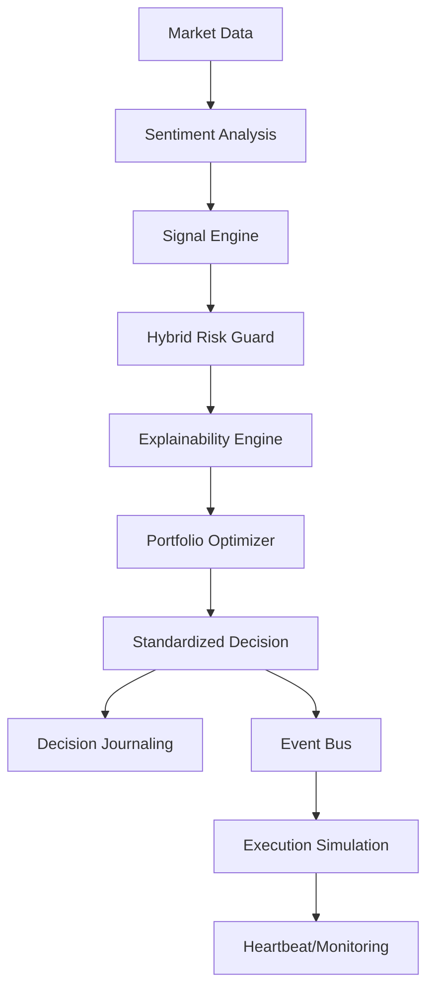

# Zeren AI Lite (Advanced Portfolio Edition)

Zeren AI Lite is an open-source, lightweight version of the commercial **Zeren AI** project, designed to showcase advanced architectural patterns, autonomous engineering practices, and global software standards.

> [!IMPORTANT]
> **Note:** This repository contains the core architectural skeleton, asynchronous communication infrastructure, and risk management logic. Proprietary trading algorithms, deep learning models, and datasets are kept private.

## 🌟 Key Features

Zeren AI Lite is designed not just as a trading bot, but as a fully **asynchronous autonomous system**:

- **🔎 Explainable AI (XAI):** Solves the "Black Box" problem by providing clear logic paths and factor attributions for every decision made by the system.
- **🌍 Global Standards:** Fully English codebase, documentation, and logging, following international software engineering best practices.
- **🛡️ Auditability:** The `Journal` module ensures every decision (Signal, Risk, Sentiment) is permanently stored as structured JSON for full transparency.
- **💓 System Monitoring:** The `Monitoring` module tracks the health and latency of all sub-components in real-time.
- **📊 Data Governance:** Standardized data flow using **Pydantic** models for strict type safety and validation.
- **🧠 Sentiment-Driven Decisions:** Integrated news and social media sentiment analysis (`SentimentAnalyzer`) as a critical decision layer.
- **🔒 Hybrid Risk Protection:** Combines rule-based safety checks with simulated neural anomaly detection (`NeuralRiskGuard`).

## 🏗️ Architectural Flow

The autonomous decision cycle follows this path:
**Market Data** -> **Sentiment Analysis** -> **Signal Generation** -> **Hybrid Risk Check** -> **XAI Attribution** -> **Decision Execution**.



## 📂 Technical Structure

- `src/core/`:
    - `data_models.py`: Pydantic schemas & XAI Data Packets.
    - `journal.py`: Decision audit trail.
    - `monitoring.py`: System health (Heartbeat).
    - `event_bus.py`: Async Pub/Sub communication.
- `src/strategy/`:
    - `sentiment_analyzer.py`: News sentiment simulation & API integration.
    - `risk_manager.py`: Kelly Criterion & Volatility management.
    - `neural_risk_guard.py`: Hybrid anomaly detection.
- `logs/`: Directory for persistent decision journals.

## ⚙️ Configuration

Copy the `.env.example` file to `.env` and configure your API keys:
```bash
cp .env.example .env
```

## 🛠️ Installation & Usage

1. **Install Dependencies:**
   ```bash
   pip install -r requirements.txt
   ```
2. **Launch the Engine:**
   ```bash
   python3 main.py
   ```

---
*© 2026 Zeren AI - Autonomous Engineering Manifesto*
