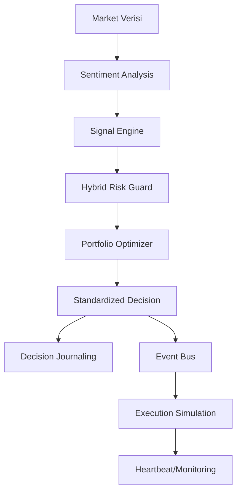

# Zeren AI Lite (Advanced Portfolio Edition)

Zeren AI Lite, ticari **Zeren AI** ekosisteminin en yüksek standartlarını (Architecture & Auditability) temsil eden, portfolyo amaçlı geliştirilmiş ileri seviye bir versiyonudur.

## 🚀 Ultra-Lite Mimari & Özellikler

Bu versiyon, bir ticaret botundan öte, **asenkron otonom bir sistem** olarak tasarlanmıştır:

- **Auditability (Denetlenebilirlik):** `Journal` modülü ile her karar (Sinyal, Risk, Duygu durumu) `logs/` dizininde kalıcı JSON olarak saklanır.
- **System Monitoring (Nabız):** `Monitoring` modülü sayesinde sistemin hayatta olup olmadığı ve gecikme süreleri anlık izlenir (`temp/heartbeats`).
- **Pydantic Data Governance:** Tüm modüller arası veri akışı (`SignalData`, `RiskReport`, `TradeDecision`) katı tip güvenliği ile standardize edilmiştir.
- **Sentiment Analysis Focus:** Haber akışı ve sosyal medya duyarlılığı (`SentimentAnalyzer`), kararları etkileyen ana katmanlardan biri olarak entegre edilmiştir.
- **Hybrid Risk Protection:** Kural tabanlı risk denetimine ek olarak simüle edilmiş neural anomali tespiti (`NeuralRiskGuard`) eşlik eder.

## 🏗️ Genişletilmiş Mimari Akış

## 📂 Teknik Dosya Yapısı

- `src/core/`: 
    - `data_models.py`: Pydantic şemaları.
    - `journal.py`: Karar günlüğü.
    - `monitoring.py`: Sistem sağlığı (Heartbeat).
    - `event_bus.py`: Asenkron haberleşme.
- `src/strategy/`: 
    - `sentiment_analyzer.py`: Haber duyarlılık motoru.
    - `risk_manager.py`: Kelly ve volatilite kontrolü.
    - `neural_risk_guard.py`: Hibrit risk katmanı.
- `logs/`: Karar kayıtlarının tutulduğu dizin.

## 🛠️ Kurulum ve Çalıştırma

1. **Bağımlılıklar:** `pip install -r requirements.txt` (Pydantic ve Pytest gereklidir).
2. **Başlat:** `python3 main.py`
3. **İzle:** `logs/` klasöründeki JSON dosyalarını inceleyerek sistemin neden karar verdiğini denetleyin.

---
*© 2026 Zeren AI - Otonom Mühendislik Manifestosu*
